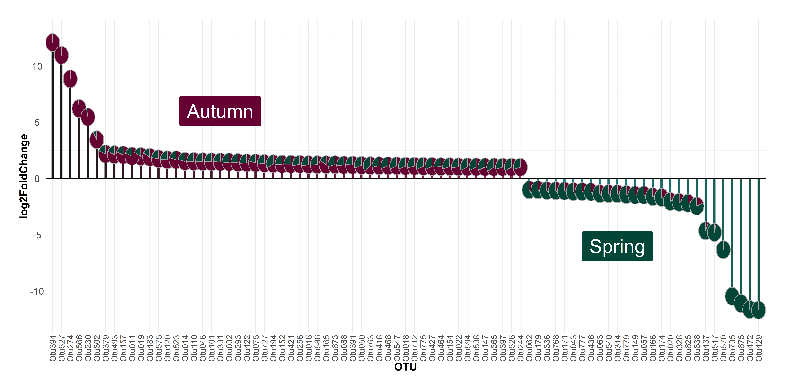

Differentially Abundant OTUs
================

With following method we caclulated OTUs that appeared to be differentially abundant in one of the two sampling season. Therefore, the DESeq2 package was used.

Load data
---------

``` r
rm(list = ls())

library(DESeq2)
library(apeglm)
library(magrittr)
library(ggplot2)
library(ggpubr)
library(gridExtra)
library(plyr)
library(scatterpie)


#setwd("02_Seasonal_Variation")

OTU_Table = as.data.frame(read.csv2("../00_Data/05_Cercozoa_Seasonal_OTU_Table_min-freq-7633_transposed_withMetadata.csv",header = T, fileEncoding="UTF-8-BOM"))

species = OTU_Table[,18:ncol(OTU_Table)]
species_mat = as.matrix(species)
SampleMetadata = as.matrix(OTU_Table[,1:17])
```

Calculate Season Correlated OTUs by Differential Abundance Analysis
-------------------------------------------------------------------

In the following steps we cacluated the differential abundant OTUs in the investigated spring and autumn samples.

``` r
#first we convert our OTU table into a DESeq2 object
ddsSeason = DESeqDataSetFromMatrix(countData = t(species_mat),
                                    colData = SampleMetadata,
                                    design = ~ Season)

#Do the differential abundance analysis
ddsSeason = DESeq(ddsSeason, 
                   minReplicatesForReplace = Inf, #This means that Outliers should not be excluded, we want the maximum amount of information
                   sfType="poscounts",
                   quiet = T)

#Convert the analysis into a "readable"" table
resSeason = results(ddsSeason, pAdjustMethod = "BH")

#Shrink the LFC (Log Fold Change)
#This shrinks the lfc into  a normal distribution, which is very handy for visualisations
resSeasonLFC = lfcShrink(ddsSeason, 
                          type = "apeglm", 
                          res = resSeason, 
                          coef = "Season_Spring_vs_Autumn", 
                          quiet = T)

#Only keep significant results
DESeq_Season_dependend_Subset = subset(resSeasonLFC, 
                                        resSeasonLFC$padj < 0.01 #highly significant pvalues less than 0.01
                                        & abs(resSeasonLFC$log2FoldChange) >= 1) #OTUs highly differential abundant, with an absolute LFC greater than 1

#Convert into a data_bframe and sort by LFC
data_b = data.frame(DESeq_Season_dependend_Subset[order(DESeq_Season_dependend_Subset$log2FoldChange),]$log2FoldChange)
colnames(data_b) = "log2FoldChange"

#For the visualisation, the values are inverted so spring-correlated OTUs appear at the bottom and autumn-correlated OTUs at the top
data_b$log2FoldChange = data_b$log2FoldChange * -1

#Create empty matrices, one for the spring season and one for the autumn
SpringMatrix = matrix(numeric(0), 0,0)
AutumnMatrix = matrix(numeric(0), 0,0)

#Then we fill the matrices with the number of reads per OTU and Season
for (a in as.factor(rownames(data_b))){ 
  a = get("a")
  get("OTU_Table")
  SpringMatrix[[a]] = sum(OTU_Table[[a]][OTU_Table$Season == "Spring"]) 
  AutumnMatrix[[a]] = sum(OTU_Table[[a]][OTU_Table$Season == "Autumn"])
}

#Convert Matrices to data_bframes and add column names
AutumnMatrix = as.data.frame(AutumnMatrix, header = F)
SpringMatrix = as.data.frame(SpringMatrix, header = F)
colnames(AutumnMatrix) = "Autumn"
colnames(SpringMatrix) = "Spring"

#Add the new columns to our data_b
data_b = cbind(data_b, AutumnMatrix, SpringMatrix)

#We subset the data_b and keep only the LFC (which will be the y-coordinates in the plot) and the Autumn and Spring Columns
data_b = subset(data_b, select = c("log2FoldChange", "Autumn", "Spring"))

#We need to add an extra column for the x-coordinates in the plot, this is just a sequence from 1 to the number of OTUs
data_b$xPosition = seq(1:nrow(data_b))
```

Plot the Figure
---------------

Now we want to visualise the season correlated OTUs:

``` r
P = data_b %>% #pipe the data_b into ggplot
  arrange(data_b$log2FoldChange, decreasing = T) %>%
  mutate(x = factor(rownames(data_b), rownames(data_b))) %>% #Define the OTUs as x-coordinates
  ggplot(aes(x = x, y = data_b$log2FoldChange)) +  #x are the OTUs, y the LFC values
  geom_segment(aes(x=x, xend=x, 
                   y=0, yend = data_b$log2FoldChange), 
               size=1.5, alpha=0.9,
               color = c(colorRampPalette(c("660033","#99004c"))(sum(data_b$log2FoldChange > 0)),
                         colorRampPalette(c("#02818a","#014636"))(sum(data_b$log2FoldChange < 0))), 
               position = position_dodge(width = 0.5)) + 
  theme_minimal(base_size = 5) + 
  theme(legend.position = "none", 
        panel.border = element_blank(),
        axis.text.y = element_text(size = 14, vjust = 0.5, hjust = 0.5), 
        axis.text.x = element_text(size =12, angle = 90, vjust = 0.5, hjust = 0.5),
        axis.title = element_text(size=16, face = "bold", hjust = 0.5)) + 
  xlab("OTU") + 
  ylab("log2FoldChange") + 
  theme(axis.title.y = element_text(size = rel(1), angle = 90))+
  theme(axis.title.x = element_text(size = rel(1), angle = 00))+
  geom_label(x = 20, y = 6, label = "Autumn", label.padding = unit(0.8, "lines"), fill = "#660033", color = "white", size = 10) +
  geom_label(x = 65, y = -6, label = "Spring", label.padding = unit(0.8, "lines"), fill = "#014636", color = "white", size = 10)+ 
geom_scatterpie(data = data_b, 
                aes(x = xPosition, y = log2FoldChange, r = 0.8), 
                cols = c("Autumn", "Spring"),
                color = "darkgrey") +
  scale_fill_manual(values=c("#660033", "#014636"))+  
  geom_hline(yintercept = 0, size = 0.5, linetype=1)+ 
  theme(plot.margin = unit(c(1,1,1,1), "cm"))

P
```



``` r
#ggsave("Differential_Abbundance_OTU_300_336x168.jpeg", plot = P, 
#       device = "jpeg", dpi = 300, width = 336, height =168, 
#       units = "mm")
#ggsave("Differential_Abbundance_OTU_600_336x168.pdf", plot = P,  
#       device = "pdf", dpi = 600, width = 336, height = 168, 
#       units = "mm")
#ggsave("Differential_Abbundance_OTU_600_336x168.tif", plot = P,  
#       device = "tiff", dpi = 600, width = 336, height = 168, 
#       units = "mm")
#ggsave("Differential_Abbundance_OTU_600_336x168.png", plot = P,  
#       device = "png", dpi = 600, width = 336, height = 168, 
#       units = "mm")
```
