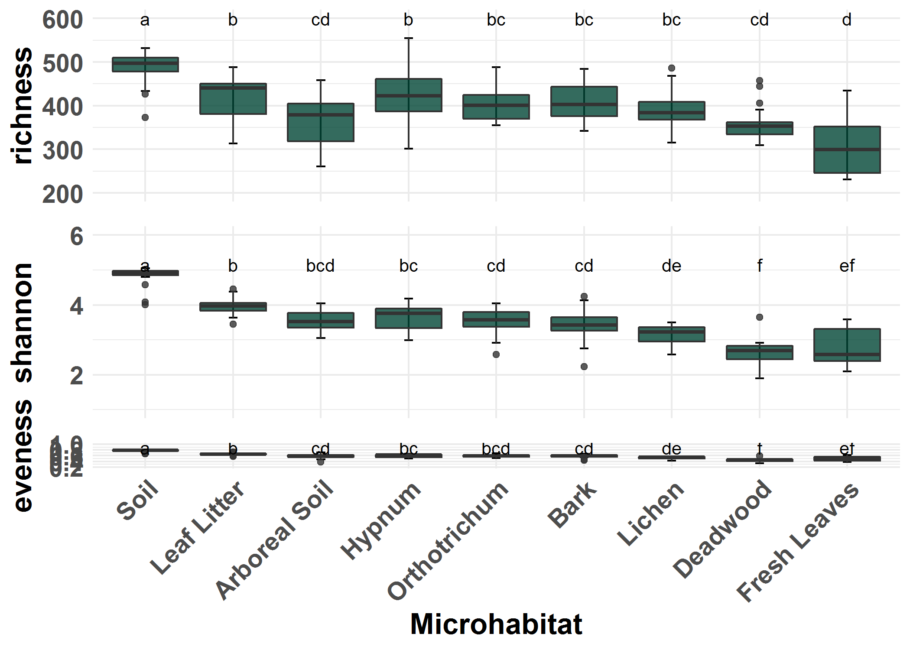
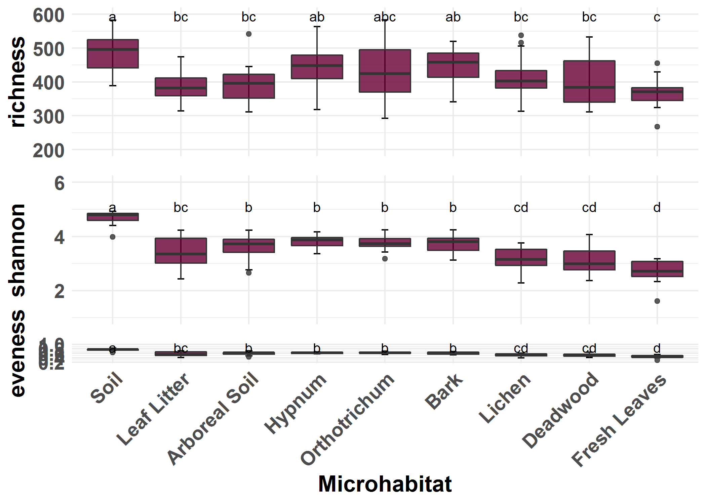

Plot alpha diversity indices grouped by season in a boxplot
================

To compare different alpha diversity indices, we calculated species richness, Simpson index, Shannon index as well as eveness for each microhabitat per season.

Load data
---------

``` r
rm(list = ls())

library(vegan)
library(reshape2)
library(ggplot2)
library(ggpubr)
library(ggsignif)
library(agricolae)


#setwd("03_Alpha_Diversity")


OTU_Table = as.data.frame(read.csv2("../00_Data/05_Cercozoa_Seasonal_OTU_Table_min-freq-7633_transposed_withMetadata.csv",header = T))
SampleMetadata = OTU_Table[,1:17]
species = OTU_Table[,18:ncol(OTU_Table)]
species_mat = as.matrix(species)


# group Sample Metadata by sampling season
SampleMetadata_Spring = SampleMetadata[OTU_Table$Season == "Spring",]
SampleMetadata_Autumn = SampleMetadata[OTU_Table$Season == "Autumn",]

# group OTUS by sampling period
OTU_Table_Spring = species_mat[OTU_Table$Season == "Spring",]
OTU_Table_Autumn = species_mat[OTU_Table$Season == "Autumn",]
```

Calculate Alpha Diversity Indices
---------------------------------

To calculate the diversity indices, simply load the table and calculate the species richness per microhabitat and sampling period, then convert it into a dataframe and add all other diversity `indices` - in this case: The Shannon Index and eveness.

``` r
# Caclulate Alpa Div for spring samples
#richness
richness = specnumber(OTU_Table_Spring)
df1 = as.data.frame(richness)
df1$Microhabitat = SampleMetadata_Spring$Microhabitat
#HSD by microhabitat
TukeyLetters_richness = HSD.test(aov(df1$richness ~ df1$Microhabitat),
                        "df1$Microhabitat")$group
TukeyLetters_richness$Microhabitat = rownames(TukeyLetters_richness)


#shannon
shannon = diversity(OTU_Table_Spring, index = "shannon")
df2 = as.data.frame(shannon)
df2$Microhabitat = SampleMetadata_Spring$Microhabitat
TukeyLetters_shannon = HSD.test(aov(df2$shannon ~ df2$Microhabitat),
                        "df2$Microhabitat")$group
TukeyLetters_shannon$Microhabitat = rownames(TukeyLetters_shannon)


#eveness
eveness=df2$shannon/log(df1$richness)
df3 = as.data.frame(eveness)
df3$Microhabitat = SampleMetadata_Spring$Microhabitat
TukeyLetters_eveness = HSD.test(aov(df3$eveness ~ df3$Microhabitat),
                        "df3$Microhabitat")$group
TukeyLetters_eveness$Microhabitat = rownames(TukeyLetters_eveness)
```

Plot the Figure
---------------

Now we want to visualise the alpha diversity indices in a combined boxplot and calculate the differences:

``` r
#richness
a = ggplot(df1, aes(x = Microhabitat, y = richness, fill = Microhabitat)) + 
  stat_boxplot(geom = "errorbar", width = 0.1, show.legend = F) +
  geom_boxplot(fill="#014636",show.legend = F, alpha=0.8) +
  coord_cartesian(ylim = c(200, 600))+
  geom_text(data = TukeyLetters_richness, aes(label = groups), y = 600,size=3.5)+
  scale_x_discrete(limits = c("Soil","Leaf Litter","Arboreal Soil","Hypnum","Orthotrichum","Bark","Lichen","Deadwood","Fresh Leaves")) + 
  theme_minimal() + 
  labs(y = "richness")+ 
  theme(axis.title.x=element_blank(),axis.text.x=element_blank())+
  theme(axis.text=element_text(size=14, face = "bold"), 
        axis.title=element_text(size=16, face = "bold"), 
        plot.subtitle = element_text(size = 16, hjust = 0.5), 
        strip.text = element_text(size = 16, face = "bold"))#,
        #axis.text.x = element_text(angle=45, hjust = 1))#+
 #theme(plot.margin = margin(1,1,1,1, "cm")) 

#a

#shannon
b = ggplot(df2, aes(x = Microhabitat, y = shannon, fill = Microhabitat)) + 
  stat_boxplot(geom = "errorbar", width = 0.1, show.legend = F) +
  geom_boxplot(fill="#014636",show.legend = F, alpha=0.8) +
  coord_cartesian(ylim = c(1, 6))+
  geom_text(data = TukeyLetters_shannon, aes(label = groups), y = 5.3,size=3.5)+
  scale_x_discrete(limits = c("Soil","Leaf Litter","Orthotrichum","Hypnum","Bark","Arboreal Soil","Lichen","Deadwood","Fresh Leaves")) + 
  theme_minimal() + 
  labs(y = "shannon")+ 
  theme(axis.title.x=element_blank(),axis.text.x=element_blank())+
  theme(axis.text=element_text(size=14, face = "bold"), 
        axis.title=element_text(size=16, face = "bold"), 
        plot.subtitle = element_text(size = 16, hjust = 0.5), 
        strip.text = element_text(size = 16, face = "bold")) #,
        #axis.text.x = element_text(angle=45, hjust = 1))#+
 #theme(plot.margin = margin(1,1,1,1, "cm")) 

#b

#eveness
c = ggplot(df3, aes(x = Microhabitat, y = eveness, fill = Microhabitat)) + 
  stat_boxplot(geom = "errorbar", width = 0.1, show.legend = F) +
  geom_boxplot(fill="#014636",show.legend = F, alpha=0.8) +
 coord_cartesian(ylim = c(0.2, 1))+
  geom_text(data = TukeyLetters_eveness, aes(label = groups), y = 0.88,size=3.5)+
  scale_x_discrete(limits = c("Soil","Leaf Litter","Arboreal Soil","Hypnum","Orthotrichum","Bark","Lichen","Deadwood","Fresh Leaves")) + 
  theme_minimal() + 
  labs(y = "eveness", 
       x = "Microhabitat")+ 
  theme(axis.text=element_text(size=14, face = "bold"), 
        axis.title=element_text(size=16, face = "bold"), 
        plot.subtitle = element_text(size = 16, hjust = 0.5), 
        strip.text = element_text(size = 16, face = "bold"),
        axis.text.x = element_text(angle=45, hjust = 1))#+
 #theme(plot.margin = margin(1,1,1,1, "cm")) 

#c

# combine all boxplots

Spring = ggarrange( a, b, c, ncol = 1, nrow = 3,align = "v")#+
                  #theme(plot.margin = margin(1,1,1,1, "cm")) 

Spring
```

 Now, repeat all the steps for autumn samples:

``` r
# Caclulate Alpa Div for Autumn samples
#richness
richness = specnumber(OTU_Table_Autumn)
df1 = as.data.frame(richness)
df1$Microhabitat = SampleMetadata_Autumn$Microhabitat
#HSD by microhabitat
TukeyLetters_richness = HSD.test(aov(df1$richness ~ df1$Microhabitat),
                        "df1$Microhabitat")$group
TukeyLetters_richness$Microhabitat = rownames(TukeyLetters_richness)


#shannon
shannon = diversity(OTU_Table_Autumn, index = "shannon")
df2 = as.data.frame(shannon)
df2$Microhabitat = SampleMetadata_Autumn$Microhabitat
TukeyLetters_shannon = HSD.test(aov(df2$shannon ~ df2$Microhabitat),
                        "df2$Microhabitat")$group
TukeyLetters_shannon$Microhabitat = rownames(TukeyLetters_shannon)


#eveness
eveness=df2$shannon/log(df1$richness)
df3 = as.data.frame(eveness)
df3$Microhabitat = SampleMetadata_Autumn$Microhabitat
TukeyLetters_eveness = HSD.test(aov(df3$eveness ~ df3$Microhabitat),
                        "df3$Microhabitat")$group
TukeyLetters_eveness$Microhabitat = rownames(TukeyLetters_eveness)
```

Plot the Figure
---------------

Now we want to visualise the alpha diversity indices in a combined boxplot and calculate the differences:

``` r
#richness
d = ggplot(df1, aes(x = Microhabitat, y = richness, fill = Microhabitat)) + 
  stat_boxplot(geom = "errorbar", width = 0.1, show.legend = F) +
  geom_boxplot(fill="#660033",show.legend = F, alpha=0.8) +
  coord_cartesian(ylim = c(200, 600))+
  geom_text(data = TukeyLetters_richness, aes(label = groups), y = 601,size=3.5)+
  scale_x_discrete(limits = c("Soil","Leaf Litter","Arboreal Soil","Hypnum","Orthotrichum","Bark","Lichen","Deadwood","Fresh Leaves")) + 
  theme_minimal() + 
  labs(y = "richness")+ 
  theme(axis.title.x=element_blank(),axis.text.x=element_blank())+
  theme(axis.text=element_text(size=14, face = "bold"), 
        axis.title=element_text(size=16, face = "bold"), 
        plot.subtitle = element_text(size = 16, hjust = 0.5), 
        strip.text = element_text(size = 16, face = "bold"))#,
        #axis.text.x = element_text(angle=45, hjust = 1))#+
 #theme(plot.margin = margin(1,1,1,1, "cm")) 

#d

#shannon
e = ggplot(df2, aes(x = Microhabitat, y = shannon, fill = Microhabitat)) + 
  stat_boxplot(geom = "errorbar", width = 0.1, show.legend = F) +
  geom_boxplot(fill="#660033",show.legend = F, alpha=0.8) +
  coord_cartesian(ylim = c(1, 6))+
  geom_text(data = TukeyLetters_shannon, aes(label = groups), y = 5.3,size=3.5)+
  scale_x_discrete(limits = c("Soil","Leaf Litter","Arboreal Soil","Hypnum","Orthotrichum","Bark","Lichen","Deadwood","Fresh Leaves")) + 
  theme_minimal() + 
  labs(y = "shannon")+ 
  theme(axis.title.x=element_blank(),axis.text.x=element_blank())+
  theme(axis.text=element_text(size=14, face = "bold"), 
        axis.title=element_text(size=16, face = "bold"), 
        plot.subtitle = element_text(size = 16, hjust = 0.5), 
        strip.text = element_text(size = 16, face = "bold")) #,
        #axis.text.x = element_text(angle=45, hjust = 1))#+
 #theme(plot.margin = margin(1,1,1,1, "cm")) 

#b

#eveness
f = ggplot(df3, aes(x = Microhabitat, y = eveness, fill = Microhabitat)) + 
  stat_boxplot(geom = "errorbar", width = 0.1, show.legend = F) +
  geom_boxplot(fill="#660033",show.legend = F, alpha=0.8) +
 coord_cartesian(ylim = c(0.2, 1))+
  geom_text(data = TukeyLetters_eveness, aes(label = groups), y = 0.87,size=3.5)+
  scale_x_discrete(limits = c("Soil","Leaf Litter","Arboreal Soil","Hypnum","Orthotrichum","Bark","Lichen","Deadwood","Fresh Leaves")) + 
  theme_minimal() + 
  labs(y = "eveness", 
       x = "Microhabitat")+ 
  theme(axis.text=element_text(size=14, face = "bold"), 
        axis.title=element_text(size=16, face = "bold"), 
        plot.subtitle = element_text(size = 16, hjust = 0.5), 
        strip.text = element_text(size = 16, face = "bold"),
        axis.text.x = element_text(angle=45, hjust = 1))#+
 #theme(plot.margin = margin(1,1,1,1, "cm")) 

#g


# combine all boxplots

Autumn = ggarrange( d, e, f, ncol = 1, nrow = 3,align = "v")

Autumn
```



``` r
#combi = ggarrange(Spring,Autumn,
#                 labels = c("A", "B"), 
#                 ncol = 2, nrow = 1, font.label = list(size = 16, color = "black")+
#        theme(plot.margin = margin(1,1,1,1, "cm"))) 
#combi

#save plot
#ggsave("BoxplotSeason_difCol_300_336x252.jpeg", plot = combi, 
#       device = "jpeg", dpi = 300, width = 336, height = 252, 
#       units = "mm")
#ggsave("BoxplotSeason_difCol_600_336x252.pdf", plot = combi, 
#       device = "pdf", dpi = 600, width = 336, height = 252, 
#       units = "mm")
#ggsave("BoxplotSeason_difCol_600_336x252.tif", plot = combi, 
#       device = "tiff", dpi = 600, width = 336, height = 252, 
#       units = "mm")
#ggsave("BoxplotSeason_difCol_600_336x252.png", plot = combi, 
#       device = "png", dpi = 600, width = 336, height = 252, 
#       units = "mm")
```
